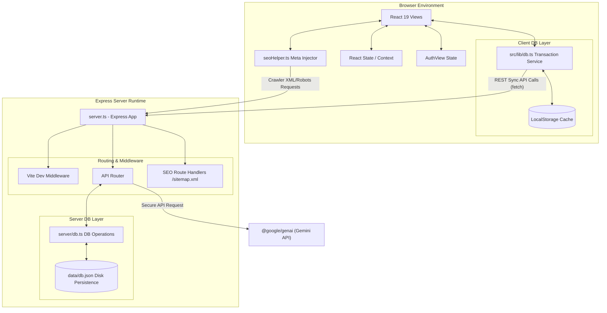
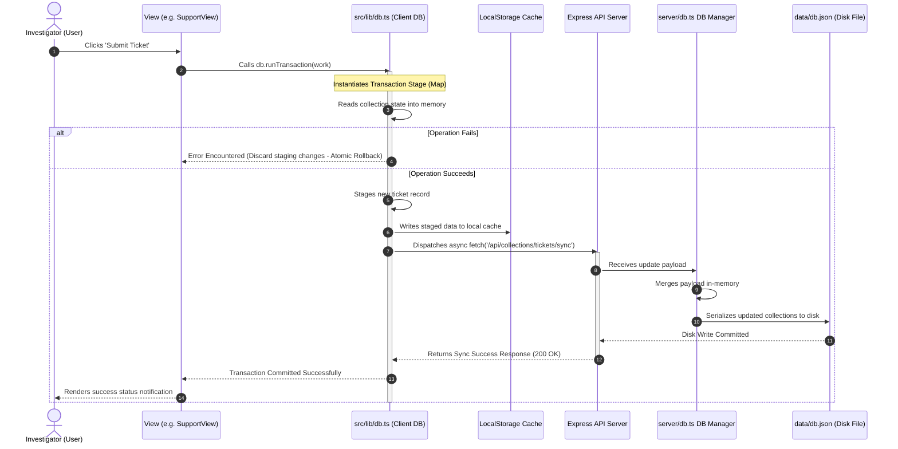
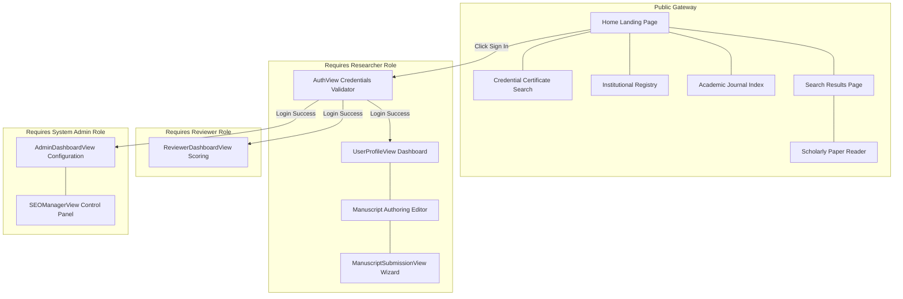

# System Architecture & Diagrams

This document contains comprehensive structural and data flow diagrams representing the Healthedia platform.

---

## 📋 Table of Contents
1. [Full-Stack System Architecture](#1-full-stack-system-architecture)
2. [Transactional State Synchronization Flow](#2-transactional-state-synchronization-flow)
3. [Client Component Hierarchy Tree](#3-client-component-hierarchy-tree)
4. [Page Navigation & State Routing Map](#4-page-navigation---state-routing-map)
5. [🔍 Agent Notes](#-agent-notes)

---

## 1. Full-Stack System Architecture

Below is a block architecture illustrating how components and sub-systems interface across network boundaries:

---

## 2. Transactional State Synchronization Flow

This sequence trace diagram illustrates the lifecycle of a user-initiated data mutation (e.g. creating a support ticket or editing a profile). It highlights the transactional roll-back and REST-synchronization pipelines:

---

## 3. Client Component Hierarchy Tree

The following diagram maps the structural components rendered inside the main application viewport:

```mermaid
graph TD
    App[src/App.tsx - Core Layout Shell] --> Nav[src/components/Navbar.tsx]
    App --> Foot[src/components/Footer.tsx]
    
    %% Views Directory
    subgraph Primary Page Views
        App --> Home[HomeView]
        App --> Search[SearchResultsView]
        App --> Paper[ResearchPaperView]
        App --> Journal[JournalView]
        App --> Inst[InstitutionsView]
        App --> Res[ResearchersView]
        App --> Work[ResearchWorkspaceView]
        App --> Review[ReviewerDashboardView]
        App --> Admin[AdminDashboardView]
        App --> SEO_M[SEOManagerView]
        App --> Auth[AuthView]
        App --> Prof[UserProfileView]
        App --> Cert[CertificateVerificationView]
        App --> Course[CoursesView]
        App --> Support[SupportView]
        App --> Legal[LegalView]
    end

    %% Nested Common Elements
    Home --> SearchBar[UnifiedSearch.tsx Autocomplete]
    Search --> SearchBar
    Paper --> Certificate[PublicationCertificate.tsx Vector]
    Cert --> Certificate
    Work --> Citations[Citations Bibliography Manager]
```

---

## 4. Page Navigation & State Routing Map

Since routing is managed in-app via a state controller (`currentPage` state), this diagram traces valid view transitions and access authorization roles:

---

## 🔍 Agent Notes

Mermaid is highly suitable for diagramming this platform because it visualizes the dual-state routing and transactional storage patterns. Note how the Client DB acts as a shield: the Views never touch the raw local storage database or dispatch network fetches directly. This decoupling guarantees that even if a server undergoes maintenance, the frontend remains fully functional in offline-simulation mode, caching changes on the client and resolving them with the API as soon as connectivity resumes.
